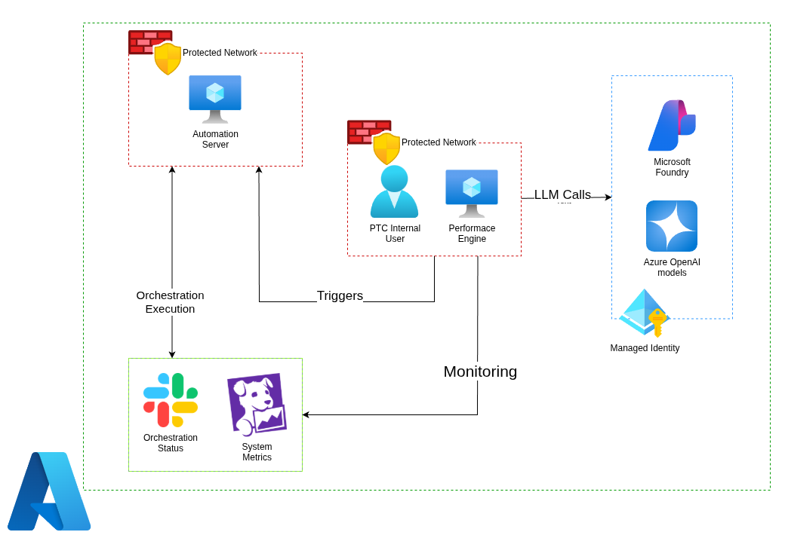

# Case Study: Autonomous Performance Engine — AI-Powered Infrastructure Operations Platform for PTC Software

## 1. The Challenge

**The client:** PTC Software, a global enterprise software company, running hundreds of internal orchestration workflows on their Protected automation server — covering internal deployments, configuration management, and day-2 operational tasks across cloud environments.

**The problem:** With hundreds of orchestrations to maintain, PTC's platform engineering team was running every workflow test manually. An engineer would trigger an orchestration by hand, watch it run, track its status across multiple internal tools, and then write up the results themselves. There was no centralised view, no automated reporting, and no structured way to validate how the platform behaved under concurrent load — testing 5, 10, or 20 orchestrations running simultaneously was a slow, error-prone, and deeply manual process.

The specific pain points were:

- **Manual execution at scale** — engineers had to trigger and monitor each orchestration individually, making it impractical to test concurrency scenarios or run regression checks across the full workflow catalogue.
- **Scattered observability** — execution status, performance metrics, and alerts were spread across Slack, Datadog, and a separate internal monitoring tool, with no single place to get a coherent picture of a test run.
- **No automated reporting** — after a test run, someone had to manually compile results. For concurrent runs across dozens of orchestrations, this was a significant time sink with room for human error.
- **No natural language interface** — triggering infrastructure actions required knowing the exact workflow names, parameters, and invocation syntax, which made the platform harder to use across team members with varying familiarity.

## 2. The Solution

**The solution:** As a Platform Automation Engineer at PTC, I architected and built the Autonomous Performance Engine — an AI-powered operations platform that lets engineers trigger, validate, and monitor infrastructure orchestrations through natural language, via both a Slack interface and a React-based dashboard. Under the hood, a single AI agent powered by Microsoft Agent Framework and Azure AI Foundry interprets requests, selects the appropriate SaltStack or Terraform workflow, executes it through Jenkins, and streams real-time telemetry back to the engineer — all without requiring direct platform access or knowledge of internal workflow syntax.

The platform was built around three core capabilities:

1. **Natural language to infrastructure action** — engineers describe what they want in plain English through Slack or the React UI; the agent resolves this to validated workflow invocations, applying governance checks before any action executes.
2. **Concurrent execution and stability validation** — the platform supports configurable concurrency scenarios (5, 10, 20+ simultaneous orchestrations), validating both conflict-free execution between workflows and platform stability under load.
3. **Automated reporting and unified observability** — every test run produces an automated report capturing execution health, CPU utilisation, memory consumption, and per-workflow outcomes, surfaced through Datadog dashboards and Slack-integrated monitoring pipelines — replacing the manual post-run writeup entirely.

### Solution Architecture

*Natural language requests enter through Slack or the React UI, are processed by the AI agent (Microsoft Agent Framework + Azure AI Foundry), which orchestrates SaltStack and Terraform workflows via Jenkins. Execution telemetry flows to Datadog and Slack in real time, with automated reports generated on run completion.*

## 3. Technologies Used

* **AI / Agent Framework:** Microsoft Agent Framework, Azure AI Foundry
* **Infrastructure Orchestration:** SaltStack, Terraform
* **CI / Execution Engine:** Jenkins
* **Observability:** Datadog, Slack API
* **Frontend:** React
* **Backend:** Python
* **Interfaces:** Slack (conversational), React UI (dashboard)

## 4. Implementation Highlights

### 4.1. AI Agent with Tool-Use for Workflow Orchestration
Rather than building a rigid rule-based automation layer, I implemented a single AI agent with structured tool use — giving it the ability to select, parameterise, and invoke the correct SaltStack or Terraform workflow based on a natural language request. The agent applies a validation step before execution, checking that the resolved action is within governance bounds before committing to any infrastructure change. This meant engineers could describe what they needed in plain English and trust the platform to translate that safely into the right workflow invocation, without needing to know internal syntax or workflow identifiers.

### 4.2. Concurrency Testing and Conflict-Free Execution
A core requirement was proving that the platform could handle concurrent orchestration runs without workflows conflicting or the platform degrading under load. I designed the execution layer to support configurable concurrency scenarios — 5, 10, and 20 simultaneous orchestrations — and built validation logic to confirm that parallel runs remained isolated, conflict-free, and completed within acceptable performance bounds. This gave the platform engineering team confidence in the system under realistic production load, not just single-run testing.

### 4.3. Real-Time Telemetry and Automated Reporting
Every execution run streams telemetry — CPU utilisation, memory consumption, execution health, and workflow-level outcomes — From Datadog in real time, replacing the previous pattern of engineers manually cross-referencing multiple internal tools. At the end of each run, the platform automatically generates a structured test report covering all orchestrations in the batch. This eliminated the manual reporting step entirely and gave teams a consistent, auditable record of every run without additional effort.

### 4.4. Dual Interface — Slack and React Dashboard
The platform was designed to meet engineers where they already worked. Slack integration means a team member can trigger a workflow, check status, or receive alerts without switching context. The React dashboard provides a broader operational view — run history, concurrent execution status, performance analytics, and report access — for engineers who need more than a conversational interface. Both surfaces feed from the same agent and telemetry layer, so there's no divergence between what Slack reports and what the dashboard shows.

## 5. Business Outcomes

> *Note: These outcomes are estimated against industry baselines for enterprise platform teams managing large workflow catalogues manually, as precise pre/post metrics were not formally tracked prior to the platform's introduction.*

* **Testing throughput:** Concurrent execution of 5, 10, and 20+ orchestrations simultaneously replaced a sequential, one-at-a-time manual process — effectively multiplying the number of workflows that could be validated in a single test cycle by an order of magnitude.
* **Manual effort eliminated:** Automated reporting removed the post-run writeup step entirely — estimated at several hours of engineering time per test cycle across a catalogue of hundreds of workflows.
* **Observability consolidation:** Execution status, performance metrics, and alerts consolidated into a single Datadog + Slack pipeline, replacing a fragmented view across multiple internal tools and reducing the cognitive load of monitoring a concurrent test run.
* **Reduced barrier to platform access:** Natural language interfaces (Slack + React UI) lowered the knowledge required to invoke infrastructure workflows, enabling broader team access without platform-specific training.
* **Governance by design:** Validation checks built into the agent execution layer ensured no workflow ran outside approved governance bounds — enforced automatically rather than relying on per-engineer discipline.

---

*This case study reflects work delivered as a Platform Automation Engineer at PTC Software, building and operationalising the Autonomous Performance Engine for internal infrastructure teams.*
